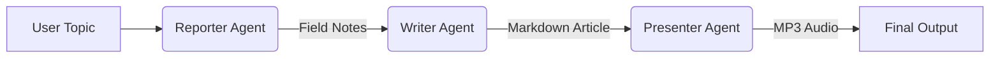

# 📰 Agent Press

**An Automated AI Newsroom powered by Google Gemini 2.0 & Python.**

Agent Press is a multi-agent system designed to automate the entire news production cycle. It employs a team of specialized AI agents to research topics, write engaging blog posts, and produce audio broadcasts without human intervention.

## 🏗 Architecture

The system orchestrates a workflow where data flows from research to presentation:



### The Agents

- **🕵️ Reporter**: Scours the web for real-time facts using **Tavily** and summarizes them into "Field Notes".
- **✍️ Writer**: Synthesizes the field notes into a polished, engaging blog post using **Gemini 2.0 Flash**.
- **🎙️ Presenter**: Converts the written article into a broadcast-script and generates audio using **gTTS** (Google Text-to-Speech).
- **👔 Editor** *(Planned)*: The orchestrator that manages the workflow and quality control.

## 🛠 Tech Stack

- **Core Model**: Google Gemini 2.0 Flash (via `google-genai` SDK)
- **Language**: Python 3.12+
- **Search Engine**: Tavily API (optimized for LLMs)
- **Audio**: gTTS (Google Text-to-Speech)
- **Dependency Management**: `uv` (fast Python package installer)

## 📂 Project Structure

```plaintext
newsroom_ai_agent/
├── config/          # Configuration files
├── news/            # Output folder for Articles and Audio
├── src/
│   ├── agents/      # Agent implementations (Reporter, Writer, Presenter)
│   ├── core/        # Core logic (Memory, Planner)
│   ├── environment/ # Simulation environment
│   ├── tools/       # External tools (Search)
│   └── utils/       # Utilities (Logging, Metrics)
├── tests/           # Test scripts
├── .env             # Environment variables (API Keys)
├── pyproject.toml   # Project settings & dependencies
└── README.md
```

## 🚀 Getting Started

### Prerequisites

- **Python 3.12+**
- **uv** (Install via `pip install uv` or `brew install uv`)
- **Google Cloud / AI Studio API Key** (for Gemini)
- **Tavily API Key** (for Web Search)

### Installation

1. **Clone the repository:**

   ```bash
   git clone <repository_url>
   cd newsroom_ai_agent
   ```

2. **Install dependencies using `uv`:**

   ```bash
   uv sync
   ```

   *This creates a `.venv` directory with all requirements installed.*

3. **Set up Environment Variables:**
   Create a `.env` file in the root directory:

   ```bash
   touch .env
   ```

   Add your keys to `.env`:

   ```env
   GOOGLE_API_KEY="your_google_api_key"
   TAVILY_API_KEY="your_tavily_api_key"
   ```

## 🚦 Usage

To verify the system and run the full "Newsroom" workflow (Research -> Write -> Speak):

1. **Activate the virtual environment:**

   ```bash
   source .venv/bin/activate
   ```

2. **Run the manual test script:**

   ```bash
   # Add the current directory to PYTHONPATH to ensure imports work
   export PYTHONPATH=$PYTHONPATH:.
   
   python tests/manual_test.py
   ```

3. **Follow the prompt:**
   - Enter a topic (e.g., "The Future of AI Agents").
   - Watch the agents work in the console.

4. **Check the Output:**
   - The generated **Markdown Article** and **MP3 Audio** will be saved in the `news/` folder.

## 🗺 Roadmap

- [x] **Phase 0**: Project Skeleton & Dependency Setup
- [x] **Phase 1**: Implement Reporter Agent (Web Search Integration)
- [x] **Phase 2**: Implement Writer Agent (Drafting Logic)
- [x] **Phase 3**: Implement Presenter Agent (Audio Generation)
- [x] **Phase 4**: Implement Editor Agent (Workflow Orchestration)
