# 📰 Agent Press: Autonomous AI Newsroom

<div align="center">

[](https://www.python.org/downloads/release/python-3120/)
[](https://deepmind.google/technologies/gemini/)
[](https://opensource.org/licenses/MIT)
[](https://github.com/psf/black)

**An autonomous multi-agent system that researches, writes, and broadcasts news stories without human intervention.**

[Features](#-key-features) • [Architecture](#-system-architecture) • [Getting Started](#-getting-started) • [Tech Stack](#-tech-stack) • [Roadmap](#-roadmap)

</div>

---

## 💡 Overview

**Agent Press** is a cutting-edge experiment in **autonomous content creation**. It employs a team of specialized AI agents working in a Cognitive Architecture to simulate a real-world newsroom.

Instead of a single LLM trying to do everything, Agent Press orchestrates a workflow where:

1. A **Reporter** agent scours the live web for facts.
2. A **Writer** agent crafts an engaging narrative.
3. A **Presenter** agent converts the story into a broadcast-ready audio segment.
4. An **Editor** agent manages the entire pipeline, ensuring quality and consistency.

This project demonstrates the power of **Agentic workflows** using Google's **Gemini 2.0 Flash** model and Python.

## 🌟 Key Features

- **🕵️ Autonomous Research**: The **Reporter Agent** uses the **Tavily API** to perform real-time web searches, filtering out noise to find the most relevant and up-to-date facts.
- **✍️ Cognitive Writing**: The **Writer Agent** leverages **Gemini 2.0** to synthesize research into polished, diverse, and engaging articles (Markdown format).
- **🎙️ AI Broadcasting**: The **Presenter Agent** utilizes **gTTS** (Google Text-to-Speech) to turn written articles into natural-sounding MP3 audio broadcasts.
- **⚙️ Robust Orchestration**: Built on a modular "Hub-and-Spoke" architecture where a central **Editor Agent** manages state, handles errors, and coordinates the specialized agents.
- **⚡ High Performance**: optimized for speed using `uv` for dependency management and asynchronous tool calls.

## 🏗 System Architecture

The system follows a linear dag-like workflow orchestrated by the Editor:

```mermaid
flowchart LR
    User[User Input] --> Editor("👔 Editor Agent")
    
    subgraph "Production Pipeline"
        Editor -- "1. Assign Topic" --> Reporter("🕵️ Reporter Agent")
        Reporter -- "Web Search (Tavily)" --> Internet(("☁️ Internet"))
        Internet -- "Live Data" --> Reporter
        Reporter -- "Field Notes" --> Editor
        
        Editor -- "2. Submit Notes" --> Writer("✍️ Writer Agent")
        Writer -- "Draft Article" --> Editor
        
        Editor -- "3. Approve Draft" --> Presenter("🎙️ Presenter Agent")
        Presenter -- "Generate Audio" --> Config(("⚙️ Config"))
    end
    
    Presenter -- "MP3 + MD" --> Output["📂 /news Folder"]
```



### The Agents

| Agent | Model | Role | Tools |
|-------|-------|------|-------|
| **Editor** | Gemini 2.0 Flash | Orchestrator | `InMemoryRunner`, `State Management` |
| **Reporter** | Gemini 2.0 Flash | Researcher | `Tavily Search API` |
| **Writer** | Gemini 2.0 Flash | Journalist | `Markdown Formatter` |
| **Presenter** | Gemini 2.0 Flash | Broadcaster | `gTTS`, `Audio Cleaner` |

## 🛠 Tech Stack

- **Core Logic**: Python 3.12+
- **LLM**: Google Gemini 2.0 Flash (via `google-genai` SDK)
- **Search**: Tavily API (Optimized for LLM RAG)
- **Audio**: gTTS (Google Text-to-Speech)
- **Dependency Management**: `uv` (The successor to pip/poetry)
- **Environment**: `.env` for secure key management

## 🚀 Getting Started

Follow these steps to set up your own AI Newsroom.

### Prerequisites

- **Python 3.12** or higher
- **uv** installed (`pip install uv` or `brew install uv`)
- API Keys for **Google Gemini** and **Tavily**

### Installation

1. **Clone the repository**:

    ```bash
    git clone https://github.com/Arif-Badhon/newsroom_ai_agent.git
    cd newsroom_ai_agent
    ```

2. **Install dependencies**:
    We use `uv` for lightning-fast installs.

    ```bash
    uv sync
    ```

    *This creates a virtual environment at `.venv` automatically.*

3. **Configure Environment**:
    Create a `.env` file in the root directory.

    ```bash
    cp .env.example .env
    # OR manually create it
    touch .env
    ```

    OPEN `.env` and add your keys:

    ```ini
    GOOGLE_API_KEY=your_gemini_api_key_here
    TAVILY_API_KEY=your_tavily_api_key_here
    ```

### ▶️ Usage

1. **Activate the Virtual Environment**:

    ```bash
    source .venv/bin/activate
    ```

2. **Run the Newsroom**:

    ```bash
    python main.py
    ```

3. **Interact**:
    - The system will ask: `What is today's headline?`
    - Enter a topic (e.g., *"The release of GPT-5"* or *"SpaceX Starship launch"*).
    - Watch as the agents research, write, and produce your news package in real-time.

4. **View Results**:
    Check the `news/` directory for your generated content:
    - 📄 `topic_name.md` ( The Article)
    - 🎧 `topic_name.mp3` (The Audio Broadcast)

## 📂 Project Structure

```plaintext
newsroom_ai_agent/
├── config/             # Configuration settings
├── news/               # 📦 Output directory for generated content
├── src/
│   ├── agents/         # 🧠 Logic for Reporter, Writer, Presenter
│   ├── core/           # ⚙️ Core definitions (State, Runner)
│   ├── environment/    # 🌍 Environment settings
│   └── utils/          # 🔧 Helper functions (Logging, formatting)
├── tests/              # 🧪 Unit and manual tests
├── main.py             # 🚀 Entry point of the application
├── pyproject.toml      # 📦 Dependency management (uv)
└── README.md           # 📖 Project Documentation
```

## 🗺 Roadmap

- [x] **Core Agents**: Reporter, Writer, Presenter implemented.
- [x] **Orchestration**: Basic Hub-and-Spoke workflow.

## 🤝 Contributing

Contributions are welcome! Please feel free to submit a Pull Request.

1. Fork the Project
2. Create your Feature Branch (`git checkout -b feature/AmazingFeature`)
3. Commit your Changes (`git commit -m 'Add some AmazingFeature'`)
4. Push to the Branch (`git push origin feature/AmazingFeature`)
5. Open a Pull Request

## 📄 License

Distributed under the MIT License. See `LICENSE` for more information.

---

<div align="center">
  Built with ❤️ by <a href="https://github.com/Arif-Badhon">Arif</a>
</div>
